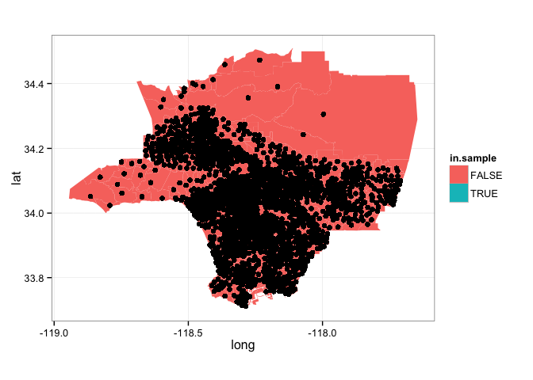

# Franchise Distributions
Will Jones  
April 1, 2015  


This project examines correlations between the number of Starbuck's locations
in an area with demographics information---such as ethnic makeup, median income,
poverty level. For the locations, this project examines census tracts in Los
Angeles County.

Census data is provided by the 2010 census for estimates of population and
ethnic makeup, while we use ACS five-year estimates for median income and
poverty level.


Here are some histograms of the basic demographic data:

 


 

Now that we have a selection of census tracts to examine, we need to find how
many Starbucks locations are nearby each. We can start by constructing a table
of locations, queried using a radar search centered at the geographic center of
the sampled census tracts.


```r
# Get the geographic centers of each of the polygons
centers <- LA.map %>%
  group_by(id) %>%
  summarise(center.x = mean(long),
            center.y = mean(lat))

LA.map %<>% left_join(centers, by=c('id' = 'id'))

ggplot(LA.map) +
  geom_polygon(aes(fill=in.sample,
                   x=long, y=lat, group=group)) +
  geom_point(aes(x = center.x, y = center.y)) + 
  coord_map() +
  theme_bw()
```

 

These geographic centers are not perfect. Tracts who have borders that do not
have evenly distributed vertices on their edges (such as ones where one side is
particularly jagged) tend to have centers that are too close to the edge. For
most of the median and small census tracts, they will work just fine.


```r
# Define function to get nearby locations
getLocations <- function(x, y, query, radius=10000) {
  # Uses Google Places to find all locations near a place.
  # Remember we want to over shoot, and then count those that
  # are actually near the borders of the 
  #
  # Args: 
  #  x: the lattitude of the center from which to search
  #  y: the longitude of the center from which to search
  #  radius: the radius of the search, in meters
  #  query: the name of the franchise to search for
  #
  # Returns:
  #  A dataframe of locations.
  
  # First, construct the query URL
  gplaces.key <- readLines('Google_API_key.txt')
  url <- 'https://maps.googleapis.com/maps/api/place/radarsearch/json?'
  url %<>% paste('key=', gplaces.key, '&', sep='')
  url %<>% paste('location=', as.character(x), ',',
                 as.character(y), '&', sep='')
  url %<>% paste('radius=', as.character(radius), '&', sep='')
  query %<>% str_replace(' ', '+')
  url %<>% paste('keyword=', query, sep='')
  
  data <- url %>% getURL() %>% fromJSON()

  
  data %<>% .$results %>% as.data.frame()
  
  output <- data_frame(place_id = data$place_id,
                       lat = data$geometry$location$lat,
                       long = data$geometry$location$lng)
  return(output) 
}

test <- getLocations(34.0429419, -118.2657636, 'starbucks coffee')
```

```
## Warning in readLines("Google_API_key.txt"): incomplete final line found on
## 'Google_API_key.txt'
```

```r
locations <- data_frame(place_id = character(),
                        lat = numeric(),
                        long = numeric())

rows <- centers %>% filter(id %in% LA.sample)

for (i in 1:nrow(rows)) {
  place <- rows[i,]
  new.locations <- getLocations(place$center.y,
                                place$center.x,
                                search.text)
  locations %<>% union(new.locations)
}
```

```
## Warning in readLines("Google_API_key.txt"): incomplete final line found on
## 'Google_API_key.txt'
```

```
## Warning in readLines("Google_API_key.txt"): incomplete final line found on
## 'Google_API_key.txt'
```

```r
ggplot() +
  geom_polygon(data = LA.map,
               aes(fill=in.sample,
                   x=long, y=lat, group=group)) +
  geom_point(data = locations,
             aes(x = long, y = lat)) + 
  coord_map() +
  theme_bw()
```

 


```r
countLocations <- function(polygon, locations, radius=5000) {
  # Counts the number of locations that are either inside the polygon, or are 
  # within the given radius of a border.
  #
  # Args:
  #  polygon: a dataframe of edges of the polygon
  #  locations: a dataframe of the locations, which is returned by getLocations
  #
  # Returns: 
  #  An integer indicating how many locations are near the polygon
  
  # First, check if the point is actually inside the polygon
  output <- point.in.polygon(locations$lat, locations$long, 
                   polygon$lat, polygon$long)
  
  # If that doesn't work, check whether they are within a certain radius of the
  # edges of of polygon.
  
  
}
```

