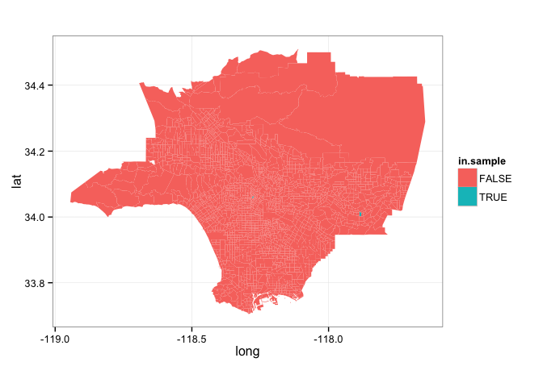

# Franchise Distributions
Will Jones  
April 1, 2015  

This is an R Markdown document. Markdown is a simple formatting syntax for authoring HTML, PDF, and MS Word documents. For more details on using R Markdown see <http://rmarkdown.rstudio.com>.

When you click the **Knit** button a document will be generated that includes both content as well as the output of any embedded R code chunks within the document. You can embed an R code chunk like this:


```r
# Load all the packages
suppressPackageStartupMessages(library(dplyr))
suppressPackageStartupMessages(library(ggplot2))
suppressPackageStartupMessages(library(ggmap))
suppressPackageStartupMessages(library(doParallel))
suppressPackageStartupMessages(library(magrittr))
suppressPackageStartupMessages(library(tidyr))
suppressPackageStartupMessages(library(rgdal))
suppressPackageStartupMessages(library(stringr))
suppressPackageStartupMessages(library(jsonlite))
suppressPackageStartupMessages(library(RCurl))


# Set up parallel processing
cpuCount <- detectCores() #From the parallel package
registerDoParallel(cores=cpuCount-1) #Don't take all cores.
```

We will examine 


 

Now that we have a selection of census tracts to examine, we need to find how
many Starbucks locations are nearby each. We can start by constructing a table
of locations, queried using a radar search centered at the geographic center of
the sampled census tracts.


```r
# Get the geographic centers of each of the polygons
centers <- LA.map %>%
  group_by(id) %>%
  summarise(center.x = mean(long),
            center.y = mean(lat))

LA.map %<>% left_join(centers, by=c('id' = 'id'))

ggplot(LA.map) +
  geom_polygon(aes(fill=in.sample,
                   x=long, y=lat, group=group)) +
  geom_point(aes(x = center.x, y = center.y)) + 
  coord_map() +
  theme_bw()
```

 

```r
# Define function to get nearby locations
getLocations <- function(x, y, query, radius=10000) {
  # Uses Google Places to find all locations near a place.
  # Remember we want to over shoot, and then count those that
  # are actually near the borders of the 
  #
  # Args: 
  #  x: the lattitude of the center from which to search
  #  y: the longitude of the center from which to search
  #  radius: the radius of the search, in meters
  #  query: the name of the franchise to search for
  #
  # Returns:
  #  A dataframe of locations.
  
  # First, construct the query URL
  gplaces.key <- readLines('Google_API_key.txt')
  url <- 'https://maps.googleapis.com/maps/api/place/radarsearch/json?'
  url %<>% paste('key=', gplaces.key, '&', sep='')
  url %<>% paste('location=', as.character(x), ',',
                 as.character(y), '&', sep='')
  url %<>% paste('radius=', as.character(radius), '&', sep='')
  query %<>% str_replace(' ', '+')
  url %<>% paste('keyword=', query, sep='')
  
  data <- url %>% getURL() %>% fromJSON()

  
  data %<>% .$results %>% as.data.frame()
  
  output <- data_frame(place_id = data$place_id,
                       lat = data$geometry$location$lat,
                       long = data$geometry$location$lng)
  return(output) 
}

test <- getLocations(34.0429419, -118.2657636, 'starbucks coffee')

locations <- data_frame(place_id = character(),
                        lat = numeric(),
                        long = numeric())

rows <- centers %>% filter(id %in% LA.sample)

for (i in 1:nrow(rows)) {
  place <- rows[i,]
  new.locations <- getLocations(place$center.y,
                                place$center.x,
                                search.text)
  locations %<>% union(new.locations)
}
  

ggplot() +
  geom_polygon(data = LA.map,
               aes(fill=in.sample,
                   x=long, y=lat, group=group)) +
  geom_point(data = locations,
             aes(x = long, y = lat)) + 
  coord_map() +
  theme_bw()
```

 


```r
countLocations <- function(polygon, locations, radius=5000) {
  # Counts the number of locations that are either inside the polygon, or are 
  # within the given radius of a border.
  #
  # Args:
  #  polygon: a dataframe of edges of the polygon
  #  locations: a dataframe of the locations, which is returned by getLocations
  #
  # Returns: 
  #  An integer indicating how many locations are near the polygon
  
  # First, check if the point is actually inside the polygon
  output <- point.in.polygon(locations$lat, locations$long, 
                   polygon$lat, polygon$long)
  
  # If that doesn't work, check whether they are within a certain radius of the
  # edges of of polygon.
  
  
}
```

