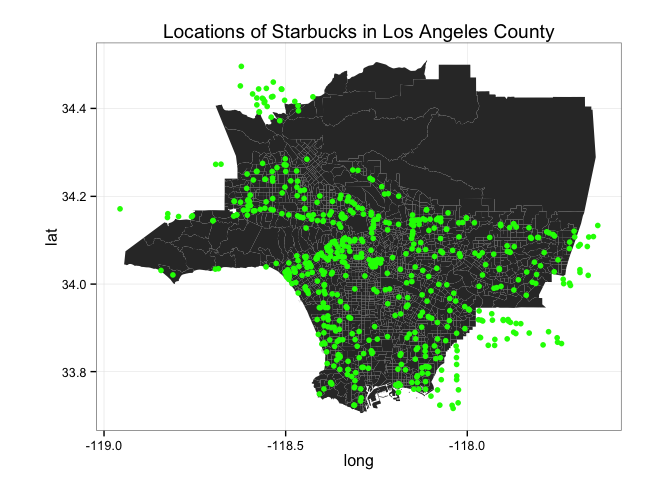

# Franchise Distributions
Will Jones  
April 1, 2015  


This project examines correlations between the number of Starbuck's locations
in an area with demographics information---such as ethnic makeup, median income,
poverty level. For the locations, this project examines census tracts in Los
Angeles County.

## Getting the Data

Census data is provided by the 2010 census for estimates of population and
ethnic makeup, while we use ACS five-year estimates for median income and
poverty level.


Here are some histograms of the basic demographic data:

 


Now that we have a selection of census tracts to examine, we need to find how
many Starbucks locations are nearby each. To get all the relevant locations in
the area, we can do a series of searches on Google around specially chosen
points. We can do this with 24 radar searches with radii of 13 kilometers. The
maximum radius is 50km, but this increases the likelihood that we will miss
locations, for the API call only returns up to 200 locations at once.(The
function here to draw circles was adapted from code written by
Gregoire Vincke, in a 
[Stack Overflow answer](http://stackoverflow.com/a/29133886/4645559).)
 


 

Notice there are some areas with no locations. To the north is Angeles National
Forest, and the western stretch is Santa Monica Mountains Recreational Area. In
some areas, that are likely less populated, the locations seem to align with
whatever freeways are nearby.

Now we need to calculate how many Starbuck's locations are near each census
tract.

 

## Exploring the Data

Looking at the population histogram again, there are several census tracts with
very few, people that give outrageously high number of Starbuck's per 1000
people. Thus, it may make sense to only look at census tracts with more than
2000 people in them. (The Census Bureau usually aims to keep census tracts near
4000 population.)

```r
la.census %<>% mutate(sb.per.1000 = sb.count * 1000 / population,
                      sb.per.1000 = ifelse(sb.per.1000 == Inf, NA, sb.per.1000))

hist(la.census$population)
```

 

```r
la.census %>% arrange(desc(sb.per.1000))
```

```
## Source: local data frame [2,203 x 8]
## 
##       Geo_FIPS population     white median.income pop.poverty rate.poverty
## 1  06037980018          1 100.00000            NA           0            0
## 2  06037980028          4  25.00000            NA           0            0
## 3  06037980009         14  92.85714        117905           0            0
## 4  06037980022          4  75.00000            NA           0            0
## 5  06037980023          8  50.00000            NA           0            0
## 6  06037980013         59  91.52542            NA           0            0
## 7  06037504102         22  45.45455            NA           0            0
## 8  06037980026         20  85.00000         82212           0            0
## 9  06037980033         61  63.93443            NA           0            0
## 10 06037551600         31  22.58065            NA           0            0
## ..         ...        ...       ...           ...         ...          ...
## Variables not shown: sb.count (int), sb.per.1000 (dbl)
```

```r
# Filter out the low population tracts
la.census %<>% mutate(sb.per.1000 = ifelse(population < 1000, NA, sb.per.1000))
qplot(x = population, y = sb.per.1000, data = la.census)
```

```
## Warning in loop_apply(n, do.ply): Removed 38 rows containing missing values
## (geom_point).
```

 

Notice there still is a relationship here between population and Starbuck's per
1000 people. 


     

There is one census tract that has 25 Starbuck's near it, but none actaully in
it. This is Griffith Park.


## Fitting a Model
Now we need to choose a model for this data. We could try a Poisson model, as
our response variable is a count, but the variance of the data is greater than
the mean, and thus our data is "overdispersed."

```r
mean(la.census$sb.count)
```

```
## [1] 4.375851
```

```r
var(la.census$sb.count)
```

```
## [1] 12.94768
```

To correct for this, we will model the data with a quasi-Poisson family. We are
filtering out the tracts with low population, and then offsetting by population,
so that it is taken into account in the model. 

```r
model <- la.census %>% filter(population > 1000) %>%
  glm(sb.count ~ 1, data = ., offset=log(population), 
      family=quasipoisson)
summary(model)
```

```
## 
## Call:
## glm(formula = sb.count ~ 1, family = quasipoisson, data = ., 
##     offset = log(population))
## 
## Deviance Residuals: 
##     Min       1Q   Median       3Q      Max  
## -3.8501  -1.3870  -0.3786   0.8366   8.3151  
## 
## Coefficients:
##             Estimate Std. Error t value Pr(>|t|)    
## (Intercept) -6.88017    0.02094  -328.5   <2e-16 ***
## ---
## Signif. codes:  0 '***' 0.001 '**' 0.01 '*' 0.05 '.' 0.1 ' ' 1
## 
## (Dispersion parameter for quasipoisson family taken to be 4.142135)
## 
##     Null deviance: 7058.2  on 2164  degrees of freedom
## Residual deviance: 7058.2  on 2164  degrees of freedom
## AIC: NA
## 
## Number of Fisher Scoring iterations: 5
```

```r
# The average number of Starbucks per 1000 people
exp(model$coefficients)*1000
```

```
## (Intercept) 
##    1.027974
```

```r
qplot(x = model$residuals)
```

 

Now here is the question: Are the distributions of Starbuck's counts, taking
into account population, statistcally different depending on the level of
poverty? 


```r
la.census %<>% mutate(poverty.bool = rate.poverty > 30)

model <- la.census %>% filter(population > 1000 & poverty.bool) %>%
  glm(sb.count ~ 1, data = ., offset=log(population), 
      family=quasipoisson)
# The average number of Starbucks per 1000 people
obs.value <- exp(model$coefficients)*1000
obs.value
```

```
## (Intercept) 
##    1.032495
```

```r
model <- la.census %>% filter(population > 1000 & !poverty.bool) %>%
  glm(sb.count ~ 1, data = ., offset=log(population), 
      family=quasipoisson)
# The average number of Starbucks per 1000 people
exp(model$coefficients)*1000
```

```
## (Intercept) 
##    1.027371
```

If we split up the census tracts by whether their povery rate is greater than
40%, we find that the intercept coefficient is fairly different, suggesting there
are different rates in the two groups.

We could try a doing a model with `glm` of `sb.count ~ rate.poverty`, but
our Starbuck's location counts are __not independent__ at all; the number of
Starbuck's near one census tract is highly correlated with the count for a
neighboring census tract.

Instead, we can use a permutation test. Let $T_P$ be the intercept coefficient
for the census tracts that have a poverty rate greater than 40% and $T_S$ be
the intercept coefficient for a random sample of census tracts (of the same
size.)

* $H_0: T_P = T_S$
* $H_A: T_P \neq T_S$


 


TO DO:

* Determine distribution of Starbucks
* For each variable, do Monte Carlo simlulation to determine whether they are
  correlated. Make each variable into a categorical variable.


