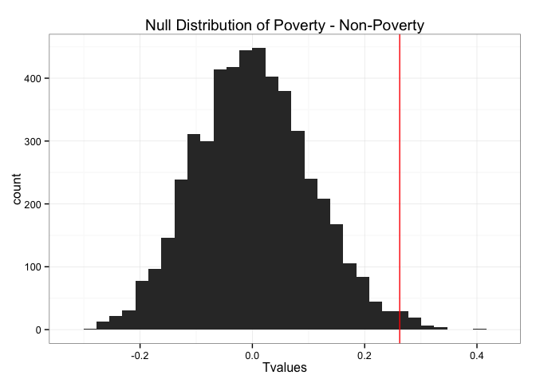

# Where are the Starbuck's At?
Will Jones  
May 11, 2015  


This project examines correlations between the number of Starbuck's locations
in an area with the rate of poverty in an area. For the locations, this project
examines census tracts in Los Angeles County.

## Getting the Data
Census data and shapefiles can be downloaded, but the location data for the
Starbuck's location needs to be scraped from Google. 

### Census Data

Census data is provided by the 2010 census for estimates of population and
ethnic makeup, while we use American Community Survey five-year estimates for 
median income and poverty level. The csv files were compiled and downloaded on
[Social Explorer](http://www.socialexplorer.com).


Here are some histograms of the basic demographic data:

 

### Los Angeles County Shapefiles
The shapefiles were acquired from the [County of Los Angeles' Open Data Portal](https://data.lacounty.gov/Geospatial/Census-Tracts-2010/ay2y-b9rg). 


### Scrapping the Location Data

Now that we have a selection of census tracts to examine, we need to find how
many Starbucks locations are nearby each. To get all the relevant locations in
the area, we can do a series of searches on Google around specially chosen
points. 

[Google's Places API](https://developers.google.com/places/webservice/) allows
developers to send HTTP request for "Radar Searches," which take a lat/long
location, a radius and search query and returns up to 200 locations in the
given radius that match the query. 

Thus, if we can cover all of LA County with a series of Radar Searches, we can
find all the locations of all Starbuck's in the area. It turns out we can
accomplish this with just 24 radar searches, each with radii of 13 kilometers.
(The maximum radius is 50km, but this increases the likelihood that we will miss
locations, for the API call only returns up to 200 locations at once.)

Below is a plot showing the arrangement of all the radar searches. (The function
used here to draw circles was adapted from code written by Gregoire Vincke, in a 
[Stack Overflow answer](http://stackoverflow.com/a/29133886/4645559).)
 

The locations have been saved as a file and are just loaded from that file in
this document. For those who are interested, though, the code used to scrape the
location data is present in the RMD file, with the portions that actually
execute the search commented out. (In order to make use of the code though, you
will need to get your own API key from Google.)

 

Notice there are some areas with no locations. To the north is Angeles National
Forest, and the western stretch is Santa Monica Mountains Recreational Area. In
some areas, that are likely less populated, the locations seem to align with
whatever freeways are nearby.

From these locations we can calculate the number of Starbuck's nearby for each
census tract. We will consider a Starbuck's location nearby if it is within
2 kilometers of the border of the census tract.

The results of this data manipulation are also saved as an R data dump, because
of how long they took to calculate. Once again, the code to make the
calculations can be found in the RMD file, with the lines that execute the
calculate commented out. (Please take a moment of silence to mourn the many
hours I lost to figuring out how to draw a circle on a spherical Earth and 
then detect whether that circle intersected with a polygon that also exists on a
spherical Earth.)

 


## Exploring the Data

Looking at the population histogram again, there are several census tracts with
very few, people that give outrageously high number of Starbuck's per 1000
people. If we look at the map with population and the locations, it becomes
clear why. Census tracts that are mainly parks have very small populations, but
are so large that they border a lot of census tracts that are populated, and
thus pick up the Starbuck's locations from those. Thus, it may make sense to
only look at census tracts with more than 2000 people in them. (The Census 
Bureau usually aims to keep census tracts near 4000 population.)
 

```
## Source: local data frame [2,203 x 3]
## 
##    population sb.count sb.per.1000
## 1           1        9  9000.00000
## 2           4       10  2500.00000
## 3          14       24  1714.28571
## 4           4        3   750.00000
## 5           8        3   375.00000
## 6          59       13   220.33898
## 7          22        4   181.81818
## 8          20        3   150.00000
## 9          61        6    98.36066
## 10         31        2    64.51613
## ..        ...      ...         ...
```


   


## Fitting a Model
Now we need to choose a model for this data. We could try a Poisson model, as
our response variable is a count, but the variance of the data is greater than
the mean, and thus our data is "overdispersed."

```r
c(mean(la.census$sb.count), var(la.census$sb.count))
```

```
## [1]  4.375851 12.947682
```

To correct for this, we will model the data with a quasi-Poisson family. We are
filtering out the tracts with low population, and then offsetting by population,
so that it is taken into account in the model. 

```r
model <- la.census %>% filter(population > 1000) %>%
  glm(sb.count ~ 1, data = ., offset=log(population), 
      family=quasipoisson)
# The average number of Starbucks per 1000 people
exp(model$coefficients)*1000
```

```
## (Intercept) 
##    1.027974
```

### Starbuck's Counts and Poverty

Now here is the question: Are the distributions of Starbuck's counts, taking
into account population, statistcally different depending on the level of
poverty? 


```r
la.census %<>% mutate(poverty = rate.poverty > 40)

modelA <- la.census %>% filter(population > 1000 & poverty) %>%
  glm(sb.count ~ 1, data = ., offset=log(population), 
      family=quasipoisson)
# The average number of Starbucks per 1000 people
exp(modelA$coefficients)*1000
```

```
## (Intercept) 
##    1.280697
```

```r
modelB <- la.census %>% filter(population > 1000 & !poverty) %>%
  glm(sb.count ~ 1, data = ., offset=log(population), 
      family=quasipoisson)
# The average number of Starbucks per 1000 people
exp(modelB$coefficients)*1000
```

```
## (Intercept) 
##    1.018293
```

If we split up the census tracts by whether their povery rate is greater than
40%, we find that the intercept coefficient is fairly different, suggesting there
are different rates in the two groups.

We could try a doing a model with `glm` of `sb.count ~ rate.poverty`, but
our Starbuck's location counts are __not independent__ at all; the number of
Starbuck's near one census tract is highly correlated with the count for a
neighboring census tract.

Essentially our effective sample size is a smaller than the number of census
tracts we observed, because the high correlation means that any given census
tract provides little additional information. 

Instead, we can use a [permutation test](http://en.wikipedia.org/wiki/Resampling_(statistics)#Permutation_tests), which does not make any assumptions
about the distribution the data comes from and will preserve the spatial
relationships between census tracts.

For the quasipoisson model we computed for this data, given the intercept term
$I$, let the average number of Starbuck's locations per 1,000 people is
$\lambda = 1000 \cdot exp(I).$ Let $\lambda_A$ be the $\lambda$ value for the
census tracts that have a poverty rate greater than 40% and $\lambda_B$ be the
value for the rest of the census tracts. Then our hypotheses will be:

* $H_0: \lambda_A - \lambda_B = 0$
* $H_A: \lambda_A - \lambda_B \neq 0$

Our test statistical that we observed from our sample is:

```r
T_obs <- exp(modelA$coefficients)*1000 - exp(modelB$coefficients)*1000
T_obs
```

```
## (Intercept) 
##   0.2624036
```

A permutation test involves calculating the test statistic for every 
permutation of the `poverty` variable, to find the null permutation
distribution. This is because the null hypothesis assumes that the `poverty`
variable carries no information about the response variable, and thus should
have no effect on the test statistic. But, we have 2,255 observations, and thus,
would have to calculate test statistics for $2,254!$ permutations! (Try typing
`factorial(2254)` into R, and it will just return `Inf`. That's how big that is.)
So instead of calculating every permutation, we will use Monte Carlo sampling 
to sample a more manageable number of permutations and use the sampling
distribution as an approximation of the full null permutation distribution. 


 
The probability of getting a value of $T$ as likely or less likely than our 
$T_{obs}$ from the null permutation distribution is 

```r
2 * (sum(Tvalues >= T_obs) + 1)/(iterations+1)
```

```
## [1] 0.01679664
```

Thus, we can say with a confidence of 98% there is a statistically significant
difference between the distribution of Starbuck's counts in poorer and wealthier
areas.

We can construct confidence intervals for these values using Bootstrapping, a
method that in similar in principle to what we just did. Bootstrapping
estimates the distribution of a statistic about a set of data by calculating
that statistic on a large number of samples from the data set, each of which
are the same size as the original data but sampled with replacement. From this
approximated distribution, we can then get the 95% confidence intervals by
finding the quantiles for 0.025 and 0.975.


```r
bootstrap.CI(5000)
```

```
## [[1]]
##      2.5%     97.5% 
## 0.9735039 1.6151930 
## 
## [[2]]
##      2.5%     97.5% 
## 0.9805523 1.0574163
```


