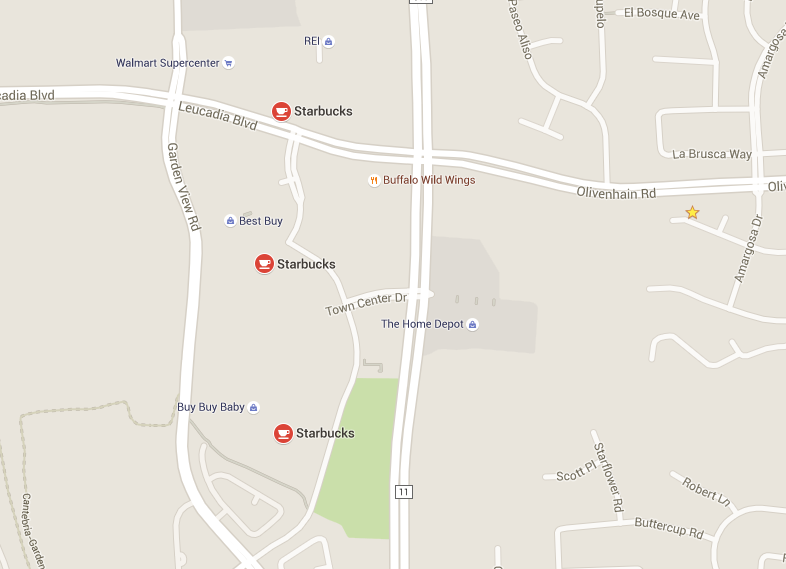
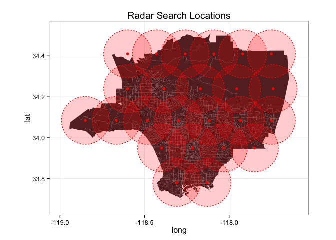
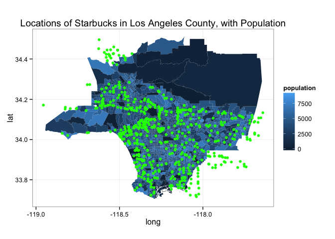

## They are Everywhere

## What I Looked At

### Specific

- Where are Starbuck's in Los Angeles County?
- Are their locations correlated with poverty?

### General

- How to scrape location data from Google Places API?
- How to calculate notion of number of Starbuck in an area?
- How to analyze this data?

## Data Sources

- Census Data
- Shapefiles 
- Google Places API

## Structure of Data

Variables:

- Census tract (level of observation)
- Population
- % of Population Below Poverty Line
- \# of Starbuck's Nearby

## Google Places API
Limitations for Radar Search

- Only 1000 requests per day
- Returns up to 200 locations at once
- Maximum radius of 50 kilometers

## The Grid

## Counting the Locations

Wanted to caputure notion of how many Starbuck's were accessible to communities
that live in particular census tracts.

Chosen criteria:

- Location within borders of census tract, __or__
- location within 2 kilometers of a border

## Location Map

## Counts

